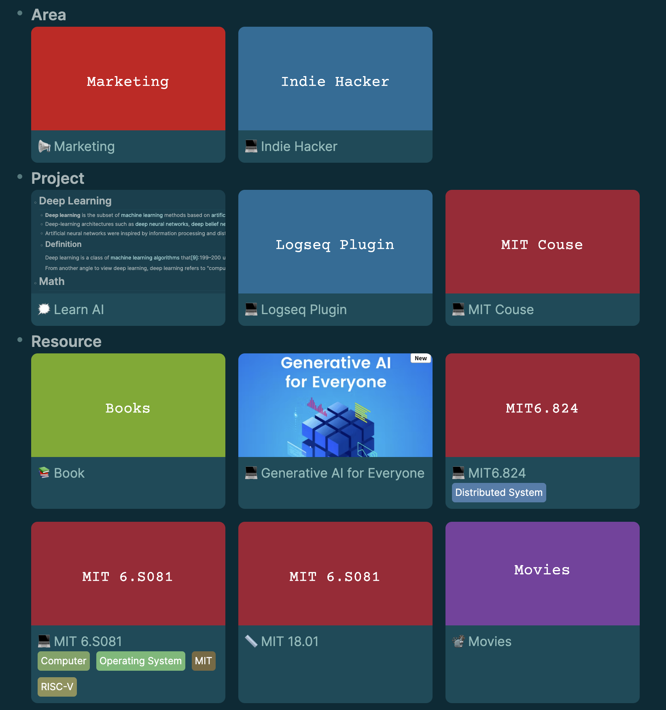

# Logseq Gallery

## Features
Offering gallery view for result of page query in Logseq. like Notion.



## Roadmap
- [x] Display Tags under title
- [x] Support generate cover from content
- [ ] Add generate cover from PDF files
- [ ] Support into editor mode when click the space of gallery
- [ ] Display the result of block query as a gallery

## Usage
```
{{renderer :gallery, <page query>, <title>}}
```
for example
```
{{renderer :gallery, (page-property tag area), Area}}
```

Support property Field
| Function | Field | Example |
| -- | -- | -- |
| Cover | `cover` | `cover:: ../assets/IMG_2694_1706277077580_0.jpeg`  |
| Banner | `banner` | `banner:: `|
| Icon | `icon` | `icon:: 💻` |  
| Tags | `tags` | `tags:: Computer, Operating System, MIT, RISC-V` |

**Note**
`cover` and `banner` are both support `../assets/IMG_2694_1706277077580_0.jpeg`, `` and `http(s)://xxx/xxx`.

if `covert` and `banner` both are empty. the cover will be the result of markdown rendered content.