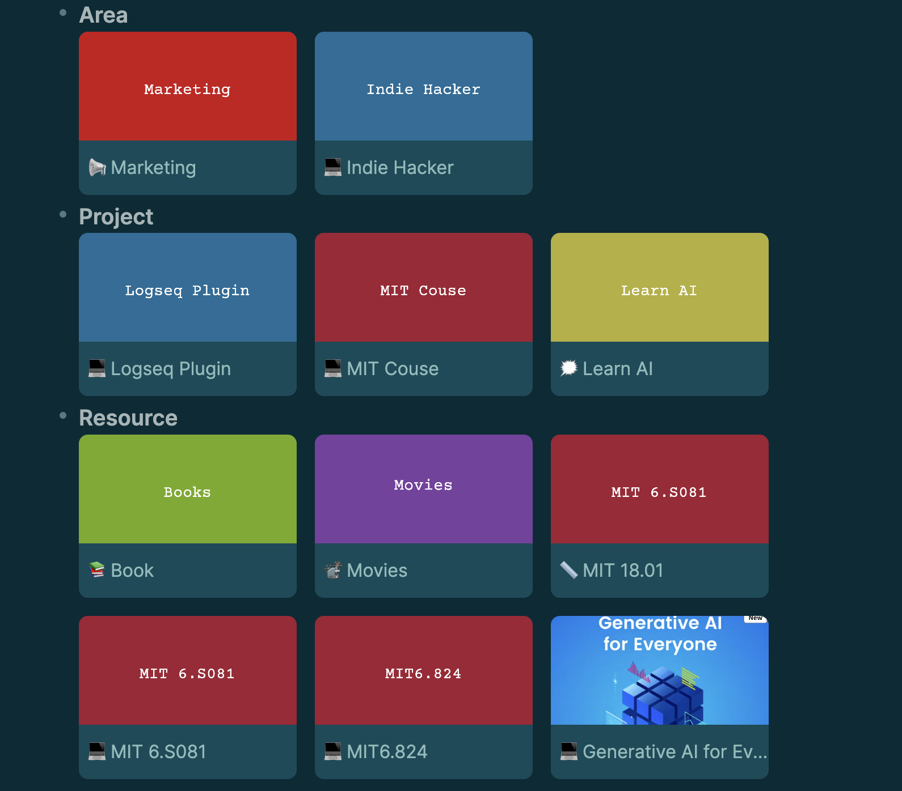

# Logseq Gallery

## Features
一个 Logseq 插件，给 page query 的结果提供 Gallery 视图。就像 Notion 一样。



## Roadmap
-[] Display Tags under title
-[] Support generate cover from content
-[] Add generate cover from PDF files
-[] Support into editor mode when click the space of gallery

## 用例
```
{{renderer :gallery, <page query>, <title>}}
```
比如
```
{{renderer :gallery, (page-property tag area), Area}}
```

Support property Field
| Function | Field | Example |
| -- | -- | -- |
| Cover | `cover` | `cover:: ../assets/IMG_2694_1706277077580_0.jpeg`  |
| Banner | `banner` | `banner:: `|
| Icon | `icon` | `icon:: 💻` |  

**注意**
`cover` 和 `banner` 是同时支持 `../assets/IMG_2694_1706277077580_0.jpeg` 和 `` 还有 `http(s)://xxx/xxx` 的语法.
